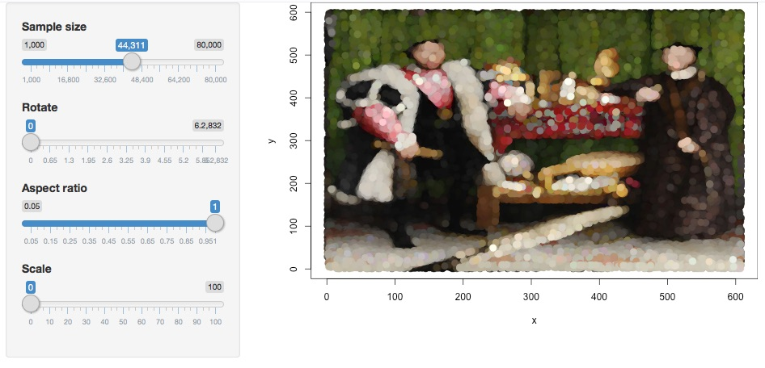
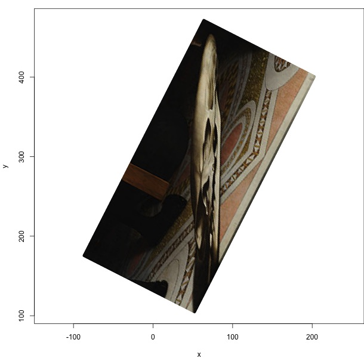
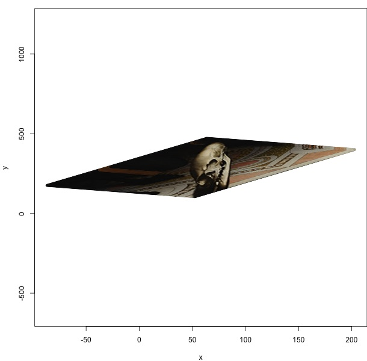
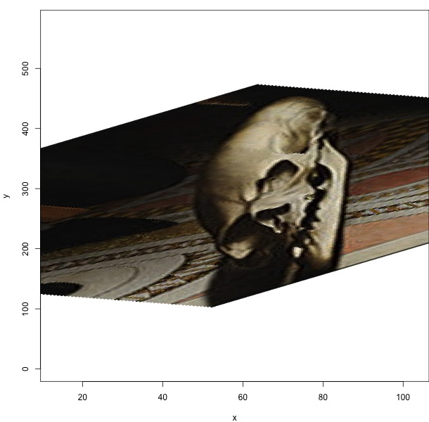

我很少看电影，欠的稿子都写不完还看毛线电影，不过前段时间《大鱼海棠》的精美画面还是吸引了我的注意力（又是从涛妹的票圈看到的），深为赞叹现在国内的动画制作技术，然而过了几天，好像评论的风向就变了。可惜了情怀这个词，现在也成了为人不齿的陈词滥调了：情怀，情你个锤子的怀，你才情怀，你全家都情怀。遥想当年，萌主（周扬）在明德楼地下咖啡厅的小房间里给我们展示 R/ECharts/Shiny 的时候，谈到情怀一词，小板凳上的我们都感受到了内心的一团火。“厉害啊！”萌主洋洋自得。

据说《大鱼海棠》可惜在用了辣么精良的画面却愣是没讲好一个故事（重申一遍：我没看，只是据说），相比之下，人家徐克老爷子二十年前用简陋的技术却做出动画片《小倩》，故事的大概情节大家看过《倩女幽魂》都知道，比《大鱼海棠》不知道高到哪里去了。

> “要来找我哦，我家就在北村，门口有棵好大好大的桃花树，记得一定要来找我哦！”

那我们就来谈谈讲故事的事。在[统计之都十周年感言](http://cos.name/2016/05/cos10-anniversery-yihui/)中我曾经提到过“精致的脑洞”，今天我就给大家解说一个五百年前的脑洞，这个脑洞是我压箱底的货，一般人我不告诉他，我第一次讲它是在我的博士论文答辩会上，后来便很少提它了。讲这个洞有两个目的，一是谈谈我对讲故事本身的一些浅见（这本不是我擅长的，但这个洞很适合讲故事），二是演示一下交互式图形的基本概念。

1533年一个叫（小）霍尔拜因的德国画家画了一幅油画，名为《大使们》。这幅画的主角是二脸懵圈的大使，长这样：

这位画家的一个显著特点就是画工极其精良，上面这幅画中的细节之清晰简直让人惊愕，感兴趣的可以去搜了[原图](https://www.nationalgallery.org.uk/paintings/hans-holbein-the-younger-the-ambassadors)来放大了仔细看：大使衣服上的一根根毛发、地球仪上的国界线、展开的乐谱、那个不知道是什么葫芦瓢乐器上断了的一根弦，等等。这特么是人画出来的么。

撇开油画的质量先不谈，相信读者第一眼看到这幅图时一定会觉得有什么奇怪的东西混进来了。没错，图的下方，地毯上那是一坨什么鬼。电脑/手机屏前的你，和二位大使一起，吉祥三宝，三脸懵圈。

## 统计图形

统计学家里我个人最服的就是 John Tukey，这位老爷子是少见的集小聪明和大聪明于一身的猛人，关于他的故事也很多，我就不瞎串场了。老爷子随手开了一派探索性数据分析，在绝大多数统计学家还在懵圈推公式的时候他搞起了什么统计图形。当年没翻起大浪，但可视化的浪潮到了今天终于还是汹涌了。八十年代末，我的博士导师之一 Di Cook 作为一个文艺青年在美国纽约街头晃荡，一心想当一名艺术家，却阴差阳错进了统计行当。2007年末，她阴差阳错和那时候还在中土大唐的我搭上线，我一看她的[个人主页](http://dicook.github.io)，嚯：

> "The greatest value of a picture is when it forces us to notice what we never expected to see."
>
> J. W. Tukey (1977)

Cook 大人接下了 Tukey 大人传下来的接力棒，捣鼓了二十来年统计图形，我想她也是因为深切感受到了 Tukey 这句话中的乐趣。统计图形的存在价值，就是让我们的狗眼注意到那些混进来的奇怪的东西。这些东西，通过别的途径很难感知。比如《大使们》图中的那一坨东西，给你一幅图，你一眼就看见了；如果换做给你像素坐标和颜色值的数据，你如何发现这幅画有不同寻常的地方？当然，现在技术发达了，图片里的异常检测也许可以做到，但我想说的是，用眼睛观察是多么容易。

我的博士论文的主题之一是交互式统计图形，所谓交互式，也就是可以用来戳戳戳敲敲敲的图形。看这个描述好像很有趣的样子，当然博士僧的现实是，在到达那乐趣之前，你还有八千二百三十三行代码要写。交互式统计图形有一些基本概念，也并不复杂。例如缩放、连接、高亮、移动、旋转等。这些工具让我们可以做很多静态图形无法做到的事情。俗话说一图胜千言，而交互式图形则相当于有无穷可能性的静态图形。下面我就用那幅油画和交互式图形工具来揭示谜底。

## 基本设定

说来惭愧，我博士期间开发的工具基本上成了一个烂尾工程，那个包安装起来太麻烦，我就不用它来演示了，而是派现在的新秀 Shiny 上场。整个[应用](https://yihui.shinyapps.io/ambassadors)的源代码在我的 Github 库里可以找到：https://github.com/yihui/shiny-apps/ 首先我们把这幅油画加载进来：

我们内心大概又一次开始抗拒了。这又是什么？莫方，这纯属为了讲故事而强行加入的插曲。故事就是应该在反复的悬念和啊哈中前进。这不，我把样本量加大一些，你就知道它是什么了：

当时答辩我最得意的大概是这幅萌得让人不忍戳的艺术再创作了。霍尔拜因大侠请饶命，小的只是随便一玩，想让答辩在一片欢乐祥和的气氛中进行下去而已。这个 Shiny 应用可以用来刷图、旋转、缩放，主要通过操作界面左边的滑动条完成，具体的实现参考源代码，基本都是高中数学知识。

## 刷刷刷

原图是否清晰已经无所谓了，我们现在需要原图的关键信息只是那个局部区域，所以我们在那萌得全是圈的图上抬手一刷，选取子区域并重绘出原图即可：

## 转转转

好嘛，现在成了个斜长条，如果你开始歪着脑袋看它就对了。何必歪脑袋呢？我们把它转一下不就好了。于是转转转，不转不是中国人。拖一下滑动条旋转大概45度：

## 压压压

哎你说你咋儿就这么长条呢？让洒家来对你实施一下二向箔打击。统计图形中有一个重要概念是纵横比（aspect ratio），这个比率是一单位的纵轴物理长度与一单位的横轴物理长度的比率，比如0.5的意思就是纵轴上0到10的距离是横轴0到10的距离一半。我们把这个比率调低一点就可以实现图形在纵向上的压缩了，下面是纵横比约为0.15时的情形：

相信多数人已经看出来这是什么鬼了。这特么还真的是个鬼啊！如果你还没看清，我再拖一下最后那个滑动条，放大一下，死给你看。

## 啊哈

对吧？啊哈！用郭德纲的话来翻译，就是哟~~西。图穷骷髅见。

## 结语

我们整天把一些网络用语诸如“城会玩”挂嘴边，其实也没见到多少真会玩的。500年前的这个霍大侠，是不是真的很会玩？这个脑洞够不够精致？

其实这个故事是我答辩前几天无意从 Cook 大人九十年代的一个幻灯片中发现的，我跟答辩委员会说，博士论文通常都是“把一堆骨头从一个坟墓搬运到另一个坟墓”，且看我搬个骨头给你们（对，洒家答辩时这种话都敢讲，当然这不是我原创，是引用一个[坦诚的逗比](http://www.quotationspage.com/quote/26037.html)的话）。搬完导师大人说，嗨，你咋把这个翻出来了，当年这个案例俺也是从俺导师那里搬来的。还真应了我引用的话。

她又给我补充了一则我当时不知道的材料：这霍大侠留下这个脑洞还有另一个邪念，这幅画从正面看不容易看出那坨东西是什么，但当这幅画挂在楼梯侧面的墙上时，那上楼梯的人，如果不经意向上45度角那么一瞥……嘿，嘿嘿，嘿嘿嘿。看老子吓不死你。

那什么是一个好故事呢？我觉得肯定有很多种，其中一种应该就是把答案就放你眼皮底下，通过一些小设定和小手段来展开，最后整个世界刹那间安静了，无声惊雷里，只剩一样东西在你脑中回响，三日不绝。

> “要来找我哦，我家就在北村，门口有棵好大好大的桃花树，记得一定要来找我哦！”

呐，我的两个鬼故事讲完了。以后分析数据时，记得看看你的数据里有什么鬼哦。

## 附言

随意给个思考题：萌萌哒大使图中，导致萌力爆发的关键代码是哪一行？
